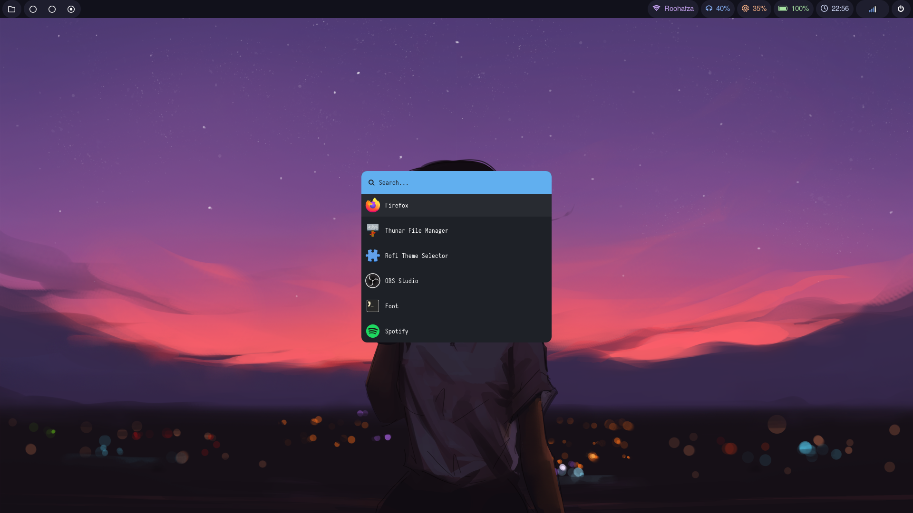
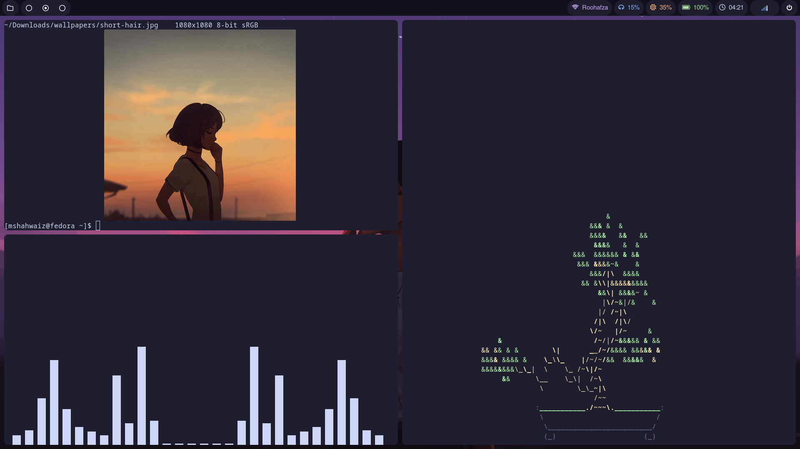
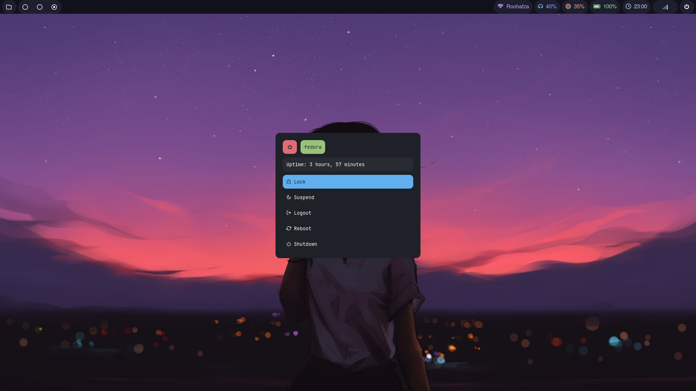

  
  
    
   

#### [System Information]
Operating system: [Fedora Sway](https://fedoraproject.org/spins/sway/)  
Window manager: [Hyprland](https://github.com/hyprwm/Hyprland)  
Launcher: [Rofi](https://github.com/davatorium/rofi)  
System bar: [Waybar](https://github.com/Alexays/Waybar)  
Terminal: [foot](https://codeberg.org/dnkl/foot)  
GTK3 settings: [nwg-look](https://github.com/nwg-piotr/nwg-look)  
Theme (for everything): [Catppuccin](https://github.com/catppuccin/catppuccin)  
Rofi modules: [adi1090x/rofi](https://github.com/adi1090x/rofi)  
  
#### [Displaying images in neofetch]  
foot needs [libsixel](https://copr.fedorainfracloud.org/coprs/lchh/libsixel/) to display images.  
`sudo dnf copr enable lchh/libsixel`  
`sudo dnf install libsixel`  
after this, follow the instructions in the [wiki.](https://github.com/dylanaraps/neofetch/wiki/Image-Backends)  

#### [Custom script for setting wallpaper in Thunar]  
`echo 'preload = %f' > ~/.config/hypr/hyprpaper.conf && echo 'wallpaper = eDP-1, %f' >> ~/.config/hypr/hyprpaper.conf`  
after this, press `Super + W` to refresh the wallpaper.  

#### [Show off scripts]  
Bonsai tree generator: [cbonsai](https://gitlab.com/jallbrit/cbonsai)  
Audio visualizer: [cava](https://github.com/karlstav/cava#package-managers)  
Image viewer: [vv](https://github.com/hackerb9/vv)  
GIF viewer: [sixvid](https://github.com/hackerb9/sixvid/tree/main)
